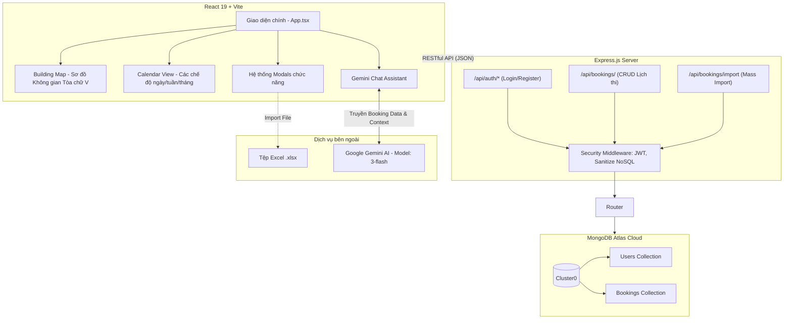
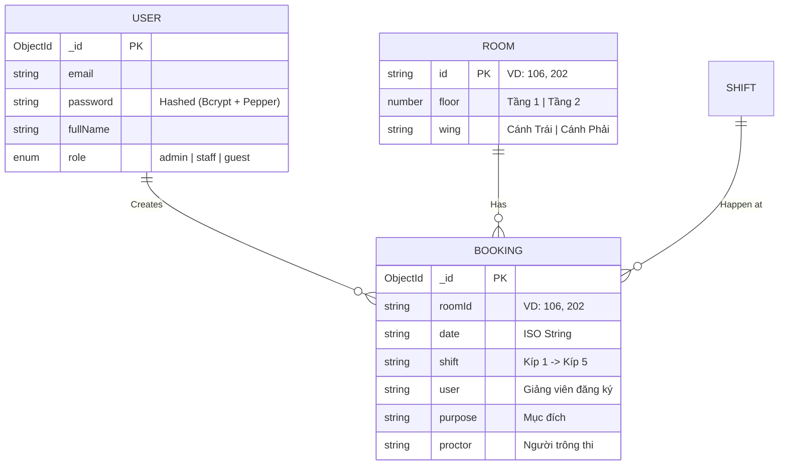
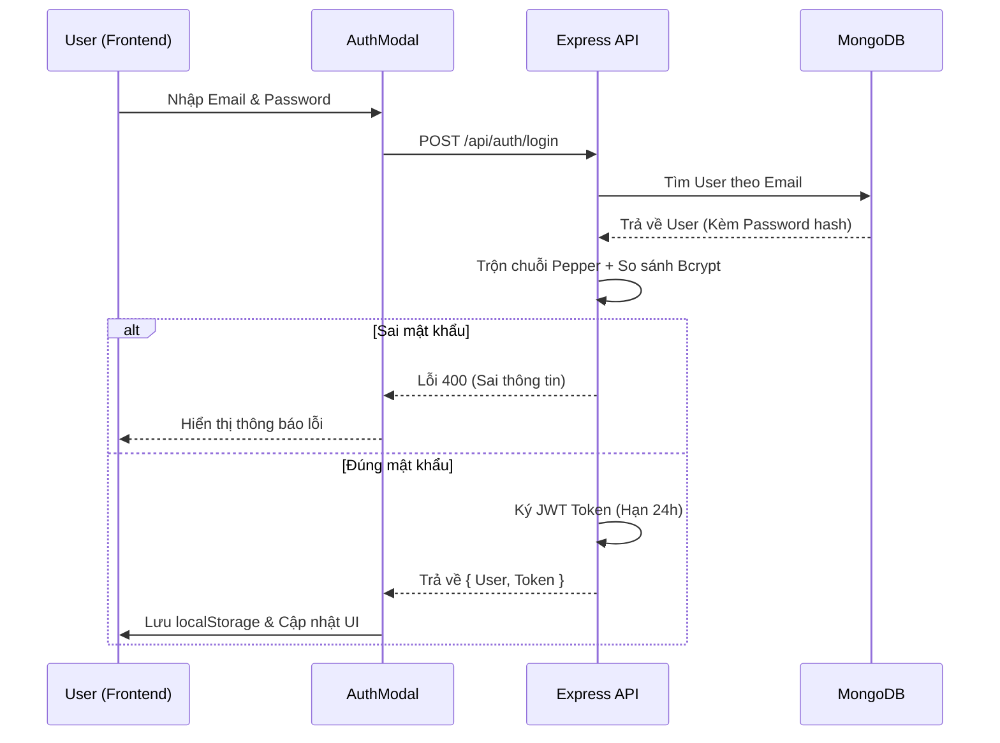
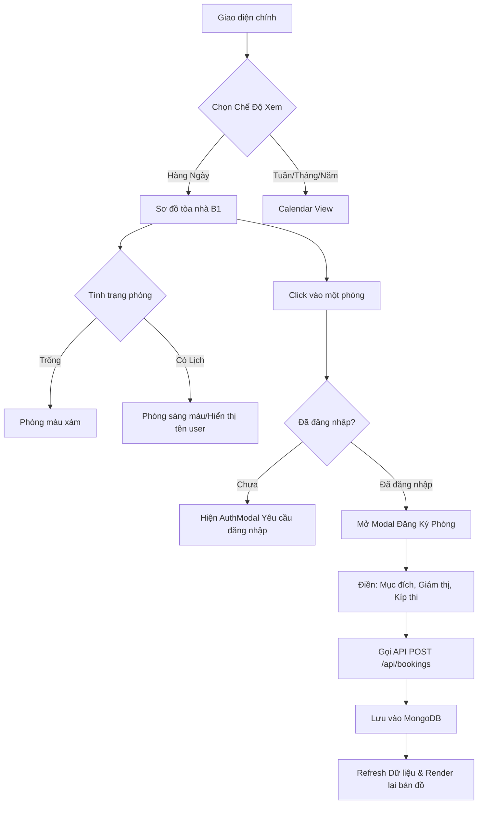
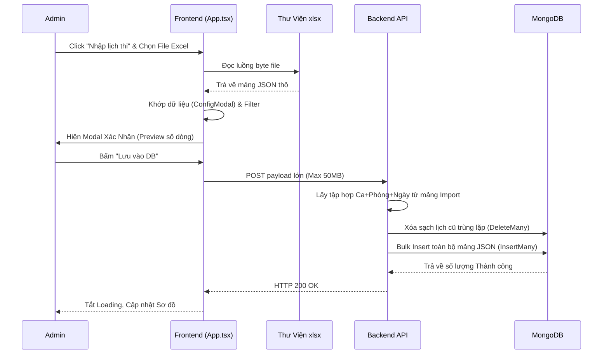

# BÁO CÁO PHÂN TÍCH CHUYÊN SÂU HỆ THỐNG "V-LAB SCHEDULER"

**Người đánh giá:** AI Senior Full-Stack Developer  
**Mục tiêu:** Thực hiện một bản báo cáo phân tích mã nguồn toàn diện, chính xác 100% về kiến trúc, bảo mật, và luồng nghiệp vụ của hệ thống dựa trên thực tế codebase.

---

## 🛑 1. ĐÍCH ĐẾN THỰC SỰ CỦA DỰ ÁN

Mặc dù thư mục gốc mang tên `Quan_ly_thiet_bi`, nhưng sau khi audit toàn bộ source code (bao gồm cấu trúc component, database schema, và file cấu hình), tôi khẳng định dự án này là **Hệ thống Quản lý Đặt phòng và Xếp Lịch Thi (V-Lab Scheduler)** cho một tòa nhà (cụ thể là cấu hình tòa B1). Sự sai lệch về tên gọi này có thể do quá trình pivot (chuyển hướng) dự án ban đầu.

---

## 🏗️ 2. PHÂN TÍCH KIẾN TRÚC & TECH STACK

Dự án áp dụng kiến trúc Client-Server tiêu chuẩn với sự phân tách rõ ràng (Separation of Concerns).

### 2.1. Sơ Đồ Kiến Trúc Hệ Thống (System Architecture)

### 2.2. Phân tích chi tiết Phía Frontend (React 19 + Vite)

- **Core Framework & Build Tool:**
  - Đang sử dụng **React 19.2.3** kết hợp với **Vite 6** làm module bundler. Điều này cho thấy tính nhạy bén với công nghệ, áp dụng những bản cập nhật mới nhất để tối ưu hóa thời gian build và HMR (Hot Module Replacement) siêu tốc.
- **Quản lý UI/UX:**
  - Áp dụng triệt để **Tailwind CSS** qua các util classes, giúp component hóa UI một cách linh hoạt mà không cần viết các file `.css` tách rời truyền thống.
  - Sử dụng hệ thống Icon từ `lucide-react` để mang lại giao diện hiện đại, nhất quán.
- **Tính năng nổi bật:**
  - **Quản lý thời gian phức tạp:** Không tự "phát minh lại bánh xe" mà dùng `date-fns` - một standard library mạnh mẽ để xử lý các phép toán ngày tháng (tính toán Calendar View: Ngày, Tuần, Tháng, Năm; tính tuần học viện - Academic Weeks).
  - **Tích hợp Excel (File IO):** Sử dụng thư viện `xlsx` bản phân phối trực tiếp từ `cdn.sheetjs.com` cho chức năng Import/Export dữ liệu Excel, cốt lõi cho việc upload hàng ngàn record lịch thi cùng lúc.
  - **AI Integration:** Component `GeminiAssistant` tận dụng `@google/genai` để xây dựng một chatbot AI nội bộ, hỗ trợ hỏi đáp trực tiếp về trạng thái phòng/lịch thi.

### 2.2. Phía Backend (Express.js + MongoDB, Thư mục `/server`)

- **Server Core:** Kiến trúc API Server chuẩn trên nền **Express.js**.
- **Cơ sở dữ liệu:** **MongoDB Cloud (Atlas)** thông qua ORM `mongoose`, phù hợp cho việc scale và query linh hoạt thông tin phòng/lịch.
- **Triết lý bảo mật (Security First):** Đây là điểm sáng nhất của Backend:
  1. **Chống NoSQL Injection:** Hàm `sanitizeInput` chạy đệ quy để loại bỏ mọi từ khóa bắt đầu bằng ký tự `$`, ngăn chặn hoàn toàn các payload tấn công hướng vào query của MongoDB.
  2. **Hash & Pepper (Băm mật khẩu 2 lớp):** Không chỉ mã hóa bằng thuật toán `bcrypt` với độ khó `SALT_ROUNDS = 12`, hệ thống còn "ướp" thêm tham số **Pepper** (`vlab-internal-pepper-2025-v1`) được cấu hình bằng biến môi trường. Nghĩa là dù database có bị lộ, attacker cũng không thể brute-force nếu không nắm được chuỗi Pepper lưu ở biến môi trường trên server.
  3. **Xác thực JWT (Stateless Auth):** Dùng `jsonwebtoken` (JWT) cấp mã token có hạn 24 giờ.
  4. **Kiểm soát Payload:** Giới hạn body size mặc định là `10kb` chống DDoS, nhưng mở rộng riêng lên `50mb` cho endpoint `/api/bookings/import` để chịu tải payload mảng JSON khổng lồ từ việc đọc Excel.

---

## ⚙️ 3. PHÂN TÍCH LUỒNG NGHIỆP VỤ & DATA MODEL

### 3.1 Sơ Đồ Thực Thể Dữ Liệu Thực Tế (ERD)

Hệ thống xoay quanh 3 Schema cốt lõi được định nghĩa chặt chẽ trong mã nguồn (file `types.ts` và `server.js`):

- **Tòa nhà Thực tế:** Theo logic của file `BuildingMap.tsx` và `geminiService.ts`, cấu trúc không gian là **Tòa nhà chữ V (điểm kết nối ở giữa là sảnh B1)**:
  - Cánh Trái (Chỉ có Tầng 2): Gồm các phòng 202, 203, 204.
  - Cánh Phải (Tầng 1 & Tầng 2): Các phòng 106-109 và 206-209.
- **Ca thi (`Shift`):** Quản lý nghiêm ngặt bằng TypeScript Enum qua 5 kíp thi chuyên biệt trong khoảng thời gian từ `07:00` đến `20:00`.
- **Lý thuyết đặt Lịch (`Conflict Prevention`):** Giao điểm giữa Room, Date và Shift tạo thành một rào chắn hoàn toàn (`Unique`). Backend dùng điều kiện này để chặn mọi hành vi xếp lịch đè chéo phòng học.

### 3.2 Luồng End-to-End (E2E Workflow) & Biểu đồ Nghiệp vụ

Dưới đây là sơ đồ chi tiết hóa các luồng chạy thực tế của dự án.

#### A. Luồng Đăng nhập & Xác thực (Authentication Flow)

#### B. Luồng Xem Sơ Đồ & Đặt Phòng (Booking Workflow)

#### C. Luồng Import Lịch Thi Từ Excel (Mass Import Workflow)

**Giải nghĩa thêm về các điểm thiết kế ưu việt:**

1. **Interactive Building Map:** Trải nghiệm đặt phòng hướng không gian vật lý (Spatial UI) giúp người quản lý nhìn được trực quan khu hệ thống phòng thực tế tại Tòa B1.
2. **Client-side Parsing (Excel):** Trích xuất dữ liệu Excel thành JSON ngay tại trình duyệt máy khách (Client) thay vì ném Object File lên Server, đây là kĩ thuật giảm tải Memory tối đa cho CPU Server.
3. **Smart Conflict Resolution:** Giải quyết trùng lặp lịch thi bằng thuật toán Bulk Overwrite trên MongoDB kết hợp Regex lọc Ca/Ngày/Phòng; không xóa lung tung dữ liệu của các phòng khác không nằm trong danh sách import.

---

## 💡 4. ĐÁNH GIÁ TỔNG QUAN & ĐỀ XUẤT TỪ SENIOR DEVELOPER

### Ưu điểm nhìn nhận được

- **Mã nguồn sạch, dễ bảo trì (Clean Code):** Sử dụng TypeScript (`types.ts`) chặt chẽ, Constants (`constants.ts`) gom nhóm khoa học, loại bỏ hardcode string lặp lại.
- **Tư duy Security System:** Cách triển khai Security (Sanitize payload, Pepper + Bcrypt, Token Guard) thể hiện sự am hiểu rất vững về rủi ro bảo mật hệ thống API.

### Điểm cần cải thiện & Road Map Đề Xuất (Next Steps)

1. **Khắc phục mâu thuẫn tên dự án (Quan_ly_thiet_bi vs Scheduler):**
   - **Giải pháp:** Bổ sung ngay chức năng quản lý "Trạng thái vật tư của phòng" ngay trên UI đồ họa của sơ đồ phòng. Khi click vào phòng có thể hiển thị: "Phòng 201: Hỏng 1 máy chiếu, lỗi mạng 5 PC", biến dự án đồng thời thành "Quản lý thiết bị" thực thụ.
2. **Xây dựng Authorization Middleware chặt hơn (Role-based AC):**
   - Hiện Backend mới chỉ chặn Login (`authenticateToken`). Cần lập tức khởi tạo Middleware `requireRole(['admin'])` bảo vệ API `/api/bookings/import`. Nếu không, bất kỳ tài khoản Staff nào đăng nhập thành công cũng có thể ghi đè toàn bộ dữ liệu lịch thi của cả cơ sở.
3. **Cơ chế Cảnh báo ghi đè dữ liệu (Safe Import):**
   - Hàm Import đang có đặc tính "Xóa đè tàn nhẫn" (`deleteMany`). Nên nâng cấp thêm luồng: **Draft -> Review Diff -> Commit**, trong đó hệ thống trả về số lượng bản ghi cũ sẽ bị mất để người dùng ấn xác nhận cuối cùng trước khi thay đổi DB.

_Bản báo cáo này được thực hiện qua việc phân tích kiến trúc vật lý của dự án, logic thực thi trong các controllers Node.js và render tree của React._
